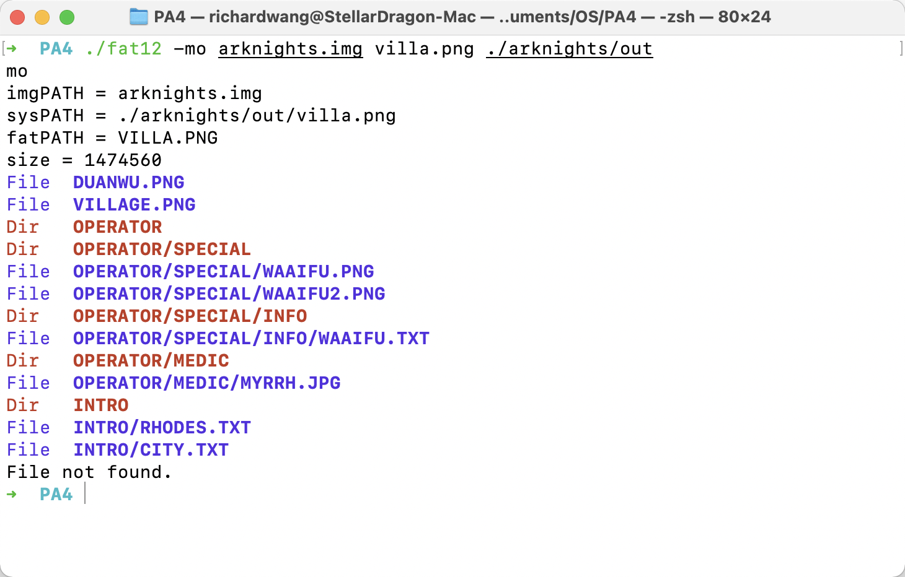

# 第四章编程作业

191300058 王一帆

191300058@smail.nju.edu.cn

## 硬链接

话不多说，上图！

因为操作系统中确实没什么硬链接数大于等于2的节点（即使有，也不容易通过这个程序访问，因为权限问题等），所以就自己创建了一个小例子。

实际情况就是这样。遍历文件确实也是很简单的，本程序用的是深度优先搜索遍历。

唯一需要注意的是，c程序不能用和终端一样的stat获取文件的链接信息，因为c标准库的stat会直接定位到链接的文件。这就导致软链接用stat读出来的inode是其链接到的文件（事实上软链接有自己的inode），这就会出问题。

解决方案就是使用lstat，这样就能得到和终端命令中类似的结果。

## 文件系统布局

### 实验要求

实现一个C语言程序fat12，能够创建并格式化一个二进制文件(大小为1.44MB)为FAT12磁盘镜像，并能将指定的宿主文件系统中的文件拷贝到该磁盘镜像中指定的目录中（若目录不存在，则需要自动创建），也能从该磁盘镜像中拷贝出某个指定的文件。程序运行样例如下：
- fat12 -f img.bin // 创建并格式化磁盘镜像文件img.bin
- fat12 -mi img.bin /demo/ fileA.txt // 将宿主文件系统当前目录下文件fileA.txt拷贝到磁盘镜像img.bin的/demo目录中
- fat12 -mo img.bin /demo/fileB.txt . // 将磁盘镜像img.bin中/demo/fileB.txt文件拷贝到宿主文件系统当前目录

### 实验报告

我已完成要求的所有功能。并且，创建的FAT12磁盘镜像还能够被系统正确识别并挂载，能够读写其中的内容。下面，让我来演示程序的运行。

### 实验演示

#### 1.编译，并实现初始化

我们以Arknights为例，给软盘添加资源。本地的资源库目录为`./arknights/`

创建好FAT12磁盘镜像后，我们先用系统加载一下它的副本，发现可以正常加载，里面没有任何文件。

#### 2.向磁盘镜像存文件

##### 向根目录添加文件

首先，向根目录添加两张图片。

加载磁盘镜像的副本，发现文件可以正常显示。

打开试试看，可以正常打开，测试成功。

##### 向深层目录添加文件

我们试着在`arknights.img`中建立一个干员目录`/operator/`，其分类为`/operator/special/`.

向其中添加两张图片：

然后在`/operator/special/info`中加入干员介绍：

打开磁盘镜像的副本，可以看到

即写入正确。

之后，我们还可以多写入一些文件。

尝试插入重复的文件：

提示该文件已经存在。

最后，新添加一种职业medic：

最下面的绿与洋红文字，揭示了文件目录按层次创建的全过程，十分清晰。

最后的磁盘镜像文件为：

#### 3.从磁盘镜像读文件

还是以大家熟悉的village为例，将其读入到`arknights/out`中

（输入了磁盘中不存在的文件，提示文件未找到）

正确填写，我们查看out文件夹：

village.png正确读取。

接下来测试一下深层目录里文件的读取。以waaifu.txt为例：

观察输出：

正确读取。至此，初始化与读写均演示完毕。

### 注意事项

#### 1.没有支持长文件名（LFN），因此短文件名只能最长8个字符的文件名+3个字符的扩展名

#### 2.没有判断从磁盘镜像中读出的是文件还是目录，只有真实的文件才能被读取出来（没实现），因此其实可以将目录项读出来（虽然没什么用）

### 实验感想

相比起scanner，fat12的完成花费了许多时间，总用时大概有10个小时了吧。

因为fat12要查很多资料，所以做起来比较耗费时间。加上对文件的读写部分，根据不同的逻辑进行划分，确实需要很多行代码实现（近2000行，这也和我最后没重构代码有关）。

因为我的目的不仅仅只是完成一个能用自己的程序进行读写的FAT12磁盘镜像，我想的是让系统也能识别，并正确读写，所以还需要考虑更多的细节部分。例如，新建的子目录中，需要添加"."和".."条目，以便让真实系统识别。并且，其余地方也同样得用空格而不是0补全，否则系统也会认为有错误。这点也花了一些时间去排查。

关于FAT表，因为现实中有两个完全一样，互为备份的FAT表，所以为了能让真实系统识别，必须在写文件的时候同时补全两个FAT表的条目。如果仅仅是让自己的程序能够读写，显然是没必要考虑这些的。

总而言之，写这个比写OSLab快乐多了，哈哈

希望以后的同学们也能体验编程作业的乐趣！

### 参考资料

StackOverflow，GitHub，CSDN，知乎

其中还有七八年前甚至更早的南大学长们写的片段（博客等）。虽然和本次编程的内容还是有不小的差距，但从中多少能吸取一些经验，加深对文件系统的理解。向他们表示感谢。

比较重要的：

http://elm-chan.org/docs/fat_e.html（原版）

https://blog.csdn.net/ZCShouCSDN/article/details/97610903（中文版本）

还有：

https://phoenix.goucher.edu/~kelliher/s2014/cs311/project7.pdf

https://github.com/qihaiyan/fat12

https://blog.csdn.net/weixin_43252268/article/details/105259119

https://blog.csdn.net/weixin_39865277/article/details/110613499

https://blog.csdn.net/JellyFishDing/article/details/102979523

https://blog.csdn.net/yuan_ping/article/details/7341722

https://blog.csdn.net/judyge/article/details/52373751

https://blog.csdn.net/qq_39654127/article/details/88429461

https://blog.csdn.net/yxc135/article/details/8769086

https://blog.csdn.net/richardzzzZ/article/details/103057517

https://blog.csdn.net/astrotycoon/article/details/8868275

https://blog.csdn.net/weixin_41315492/article/details/104723000

https://blog.csdn.net/begginghard/article/details/7284834

https://www.pianshen.com/article/611911683/

http://blog.sina.com.cn/s/blog_3edcf6b80100crz1.html

http://blog.sina.com.cn/s/blog_3edcf6b80100cr08.html

http://blog.sina.com.cn/s/blog_4d7d5ba50100hydo.html

https://zhuanlan.zhihu.com/p/43296291

等等等等

